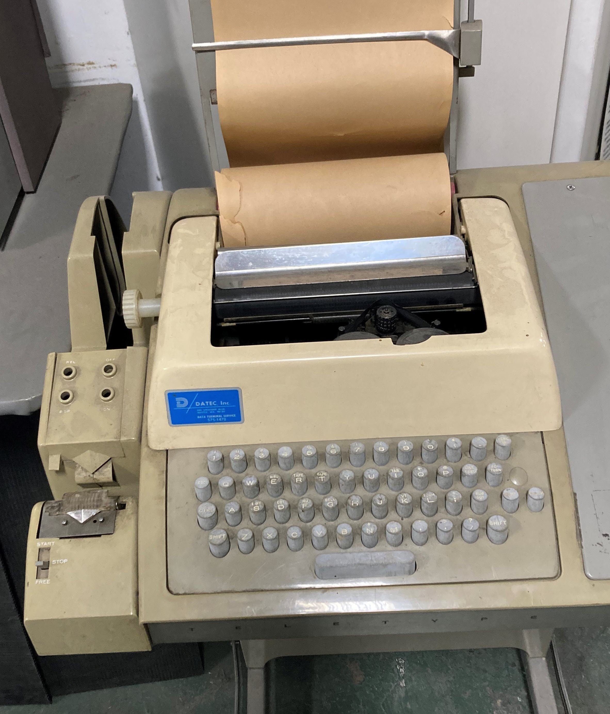

# Editors

These notes are intended to bring you up to speed with using the Linux editors at the command line. This is an essential skill for any administrator. Some of us learned to use the vi editor in the 1990s and are still using that familiarity today. We will look at some other editors and will also familiarize you with the standard Debian editor, nano.

Back before video terminals and PCs, the most common interface to a computer was a teletype terminal. To a modern eye, this would look like a fairly clunky typewriter. Companies were still maintaining this equipment even in the mid-1990s although by this time, it was much cheaper to use a PC as a teletype emulator.

<figure><figcaption></figcaption></figure>

The bottom line is, you need a text interface to a computer. You need to be able to type instructions and to get some sort of feedback from the operating system. Much of what we will see in the coming lessons will seem archaic; that's because it is!

The tools present at the Linux command line date back to the early 1970s and in many cases, they show it. However, these tools are the only ones guaranteed to be available in every version of Unix, at the command prompt. At this point we need to consider the concept of a modal editor. As the name suggests, this is an editor with different modes of operation.

When you start many of the editors we will look at, they are in command mode. Anything you type will be considered to be a command. If you tell the editor to switch to editing mode (by a single letter command such as **a** for append or **i** for insert) then you change to text editing mode. To get back to command mode requires a magic key, in most cases the escape key.

**ed** is the original line editor for Unix operating systems. It was one of the first end-user programs hosted on the system and has been standard in Unix systems ever since. **ed** was originally written by Ken Thompson (one of the originators of Multics and Unix) and it holds a place in history for some of its architecture and implementation, such as regular expressions. **ed** was influenced by an earlier editor known as QED from University of California at Berkeley and went on to influence **ex**, which developed into the **vi** editor. The Unix commands **grep** and **sed** were very much based on special uses of **ed**. This influence is visible in the design of **awk** and in aspects of Perl.

**ed** was the typical early editor in Multics and Unix. The editor was powerful and efficient for its time, using very little computer resource. It worked well with teletypes and the display equipment of the time. I programmed and configured very large automation systems (paper mills, pulping plants, etc.) in assembly language using **ed** on an old teletype. It had a command mode and an edit mode, as we will see later, this became the standard for UNIX editors. The modern screen-oriented version of **ed** is our most important editor, **vi** or on some system **VIM**.

In Ubuntu/Debian systems, we see a different editor called **nano** which is much easier to use.

**EMACs** is also a popular command-line editor.

I am teaching using Debian family distros, normally Ubuntu. For this reason, I'm only going to use **nano** in most of my notes.
