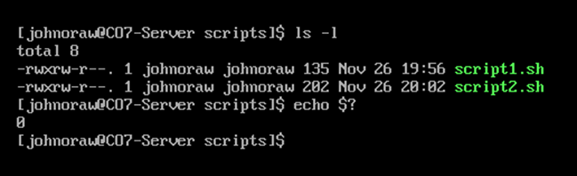

# Exit Codes

When a process terminates in Linux, it returns an eight-bit code to the parent process.

<figure><figcaption></figcaption></figure>

When we run a command in the shell, it always returns an exit code. To get the exit code of the previous command type;

```
echo $?
```

at the command prompt.

The next thing I have done is to try to run **cat** against a non-existent file.&#x20;

<figure><figcaption></figcaption></figure>

The **cat** command returns a message to STDOUT (the screen) informing me that the attempt failed. What I don’t normally see is that it also returned a “1” to the shell. We can use this information as the basis for conditional branching and decision making in scripts.

Finally, we also explain the line

```
exit 0
```

in all the previous sample scripts, we are unconditionally exiting with a success (0) being returned to the shell. We could make decisions in the script and return other values to the shell.

We can provide user-specific return codes, but some codes have been standardized \[1] and should only be used for their intended purpose. Check the standardized codes now.
